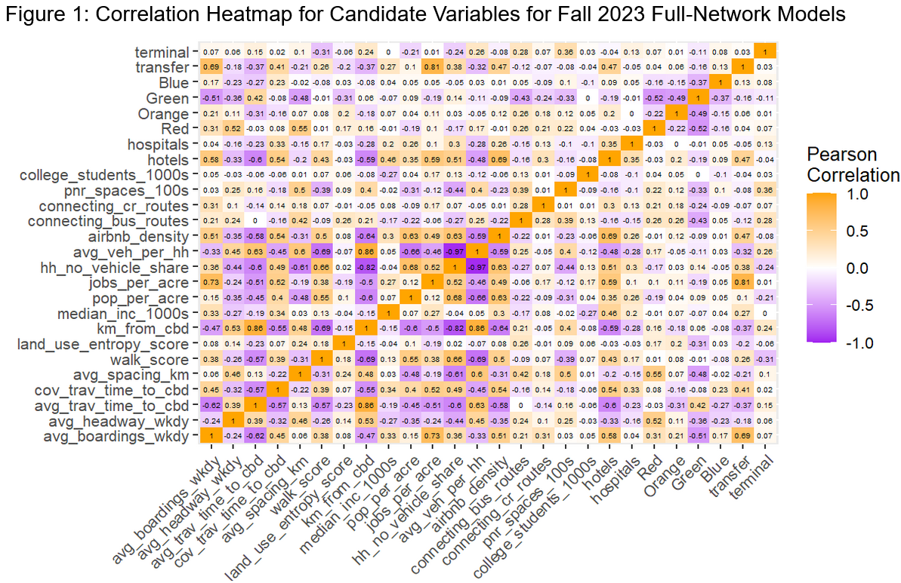
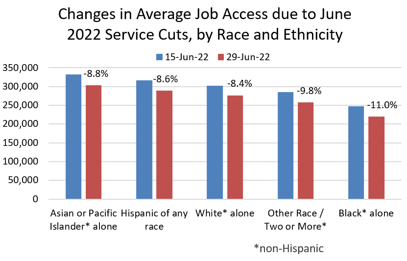

# About me :wave:
Geospatial data analyst with 5+ years of experience spanning the full analytics life cycle, from project scoping and stakeholder communication to data wrangling and interactive visualization. 

*
Table 1: Ethan's analytical career, in brief
*

| Amazon  (2019-2021) | City of Boston  (2022-2024) | MassDOT/MBTA  (2024-present) |
| :--------: | :------: | :-------: |
| Bin Meister | Research Associate | Senior Data Analyst |
| built reports to improve warehouse operations | researched post-COVID demographic and economic trends | developed transportation performance metrics | 

In spring 2025, I completed my MS in Urban Informatics at Northeastern University, where I explored how we measure the performance of our public transportation systems. Read on to learn more about some of the data analysis & research projects I completed. 

# Measuring Success for Public Transit :trolleybus:
Not only does public transit deliver direct benefits to riders through affordable connections to jobs and services, but it also has indirect benefits to non-riders through congestion relief and reduced emissions. Like any infrastructure, though, public transit costs money to build and operate. 

How can we ensure that the money we spend on public transit is prioritized for the investments that will do the most good? An important step is to carefully consider which metrics we use to evaluate public transit performance, since different metrics can favor different investments. 

Two of the most important kinds of metric that are used to evaluate overall public transit performance and estimate future benefits are:
-  **ridership** (how many trips people take)
-  **access** (how many places people can reach)

<i>Tangent: are ridership and access the only goals that transit agencies have?

 Most transit agencies don't seek to narrowly maximize ridership or access at an aggregate level. In fact, a large portion of transit service is explicitly designed not to maximize total ridership or access, but instead to provide a basic level of service to a wide swath of communities, a dynamic which Jarrett Walker calls the "<a href="https://humantransit.org/2018/02/basics-the-ridership-coverage-tradeoff.html">ridership-coverage tradeoff</a>". Different agencies apply different value judgments about how to distribute service.

Although ridership and access are not the only goals that transit agencies have, both kinds of metric remain in widespread use, especially for evaluating large-scale service changes.</i>

_

## Ridership
One reason why ridership is such an important and ubiquitous metric of public transit performance is that both the direct and indirect benefits of transit tend to increase in proportion with the number of transit trips people take.

I analyzed some of the factors that predict MBTA subway ridership and found that:
* higher ridership comes from not just more frequent and faster train connections, but also from mixed land uses and walkability in the neighborhoods surrounding stations
* many of the factors that predict high ridership are highly correlated with each other, making conventional modeling techniques difficult

View full project: [Using Open Data to Enhance Station-Level Ridership Models](https://mciethan.github.io/project1.html)

## Access

Given transportation’s fundamental purpose of connecting people to valued destinations, transportation systems and investments are increasingly measured by how many destinations they enable people to reach, rather than by how they facilitate mobility (more and faster travel) alone.

I compared how many jobs people could access via MBTA transit service before and after a round of service cuts, showing that:
* improving operating frequencies on existing transit infrastructure can yield job access gains that dwarf those provided by major expansions of infrastructure
* seemingly universal transit frequency changes can have highly unequal impacts on job access for different neighborhoods and populations

View full project: [Measuring the Effects of Public Transit Operations on Job Access in Boston](https://mciethan.github.io/project2.html)

Expanding on this line of work, I investigated the changes in job access resulting from the seemingly minor schedule adjustments that transit agencies periodically make throughout a given year, revealing that:
* transit schedule adjustments produce substantial and non-random quarter-to-quarter variability in job access
* accounting for day-to-day variability can yield more robust measures of access with which to evaluate longer-term transportation investments

[image TBD]

View full project: [Evaluating the Impacts of Public Transit Schedule Variability on Destination Access](https://mciethan.github.io/project3.html)