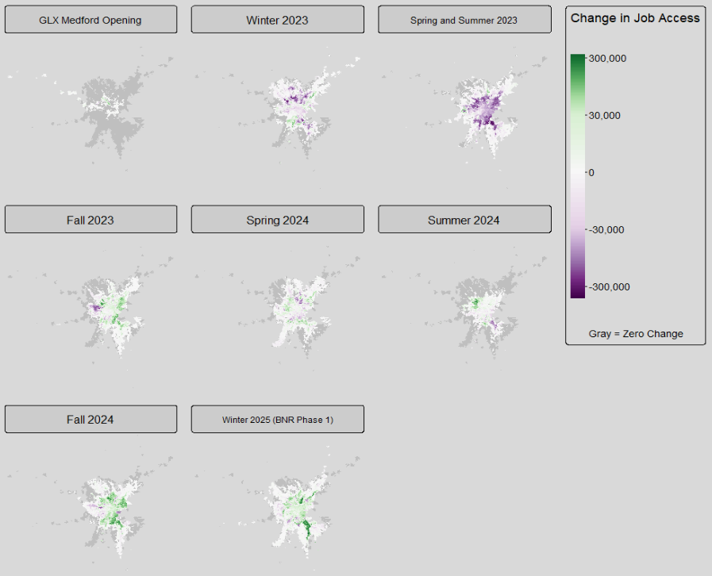

# About me :wave:
Geospatial data analyst with 5+ years of experience spanning the full analytics life cycle, from project scoping and stakeholder communication to data wrangling and interactive visualization. 

*
Table 1: Ethan's analytical career, in brief
*

| Amazon  (2019-2021) | City of Boston  (2022-2024) | MassDOT/MBTA  (2024-present) |
| :--------: | :------: | :-------: |
| Bin Meister | Research Associate | Senior Data Analyst |
| built reports to improve warehouse operations | researched post-COVID demographic and economic trends | developed transportation performance metrics | 

In spring 2025, I completed my MS in Urban Informatics at Northeastern University, where I explored how we measure the performance of our public transportation systems. Read on to learn more about some of the data analysis & research projects I completed. 

# Measuring Success for Public Transit :trolleybus:
Not only does public transit deliver direct benefits to riders through affordable connections to jobs and services, but it also has indirect benefits to non-riders through congestion relief and reduced emissions. Like any infrastructure, though, public transit costs money to build and operate. 

How can we ensure that the money we spend on public transit is prioritized for the investments that will do the most good? An important step is to carefully consider which metrics we use to evaluate public transit performance, since different metrics can favor different investments. 

Two of the most important kinds of metric that are used to evaluate overall public transit performance and estimate future benefits are:
-  **ridership** (how many trips people take)
-  **destination access** (how many places people can reach)

<i>Tangent: are ridership and access the only goals that transit agencies have?

 Most transit agencies don't seek to narrowly maximize ridership or access at an aggregate level. In fact, a large portion of transit service is explicitly designed not to maximize total ridership or access, but instead to provide a basic level of service to a wide swath of communities, a dynamic which Jarrett Walker calls the "<a href="https://humantransit.org/2018/02/basics-the-ridership-coverage-tradeoff.html">ridership-coverage tradeoff</a>". Different agencies apply different value judgments about how to distribute service.

Although ridership and access are not the only goals that transit agencies have, both kinds of metric remain in widespread use, especially for evaluating large-scale service changes.</i>

_

## Ridership
One reason why ridership is such an important and ubiquitous metric of public transit performance is that both the direct and indirect benefits of transit tend to increase in proportion with the number of transit trips people take.

I analyzed some of the factors that predict Massachusetts Bay Transportation Authority (MBTA) subway ridership and found that:
* higher ridership comes from not just more frequent and faster train connections, but also from mixed land uses and walkability in the neighborhoods surrounding stations
* many of the factors that predict high ridership are highly correlated with each other, making conventional modeling techniques difficult

#### __Key Methods__:
regression modeling at the station level using R and Python scripting

#### __Key data sources__:
public transit schedules, US Census demographic and jobs data, City of Boston license data, MassGIS parcel data, National Center for Education Statistics college enrollment data

#### __View full project__: [Using Open Data to Enhance Station-Level Ridership Models](https://mciethan.github.io/project1.html)

## Destination Access (Part 1)

Given transportation’s fundamental purpose of connecting people to valued destinations, transportation systems and investments are increasingly measured by access (how many destinations they enable people to reach), rather than only by mobility (more and faster travel).

I compared how many jobs people could access via MBTA transit service before and after a round of service cuts in June 2022 and a route extension in December 2022, showing that:
* improving operating frequencies on existing transit infrastructure can yield job access gains that dwarf those provided by major expansions of infrastructure
* seemingly universal transit frequency changes can have highly unequal impacts on job access for different neighborhoods and populations

Using demographic data from the decennial census, I found that non-Hispanic Black residents not only had the lowest average existing access to jobs within 30 minutes of transit + walking travel time, but also experienced the steepest declines in average job access due to the June 2022 service cuts.

#### __Key Methods__:
origin-destination network analysis (transit + walking) at the census block level using ArcGIS Pro workflow; cumulative job access

#### __Key data sources__:
public transit schedules (GTFS), US Census demographic and jobs data, OpenStreetMap walking network data

#### __View full project__: [Measuring the Effects of Public Transit Operations on Job Access in Boston](https://mciethan.github.io/project2.html)

## Destination Access (Part 2)

Expanding on this line of work, I performed a more systematic investigation of the changes in job access resulting from the seemingly "minor" schedule adjustments that transit agencies implement on a regular basis, revealing that:

* quarterly adjustments to transit vehicle frequencies and timings produce substantial and demographically disparate differences in job access
* existing policy thresholds defining when a service change is "major" enough to require analysis of social equity impacts may be too narrow 

The maps below illustrate how eight consecutive MBTA service adjustments affected the numbers of jobs accessible within 60 minutes of transit + walking for census blocks in the MBTA service area. Only the December 2022 opening of the Medford branch of the Green Line Extension (GLX) and the December 2024 implementation of Phase 1 of the Bus Network Redesign (BNR) were considered "major" changes under existing policy.

#### __Key Methods__:
origin-destination network analysis (transit + walking) at the census block level using R scripting; cumulative job access

#### __Key data sources__:
public transit schedules, US Census demographic and jobs data, OpenStreetMap walking network data

#### __View full project__: [Measuring the Destination Access Impacts of Public Transit Service Adjustments](https://mciethan.github.io/project3.html)