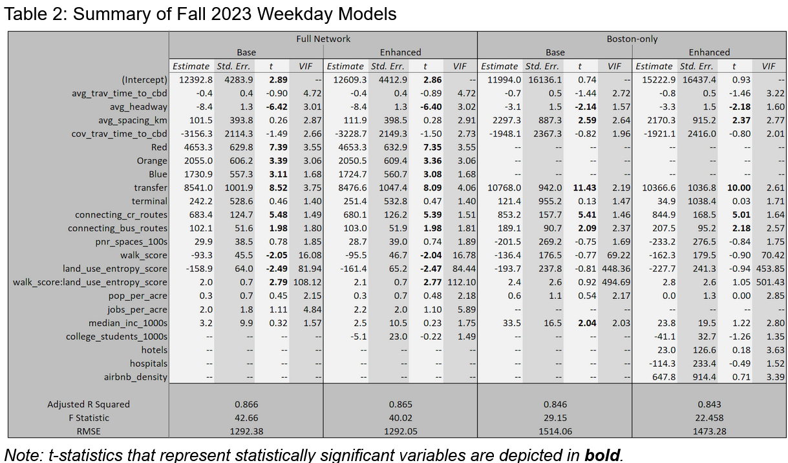
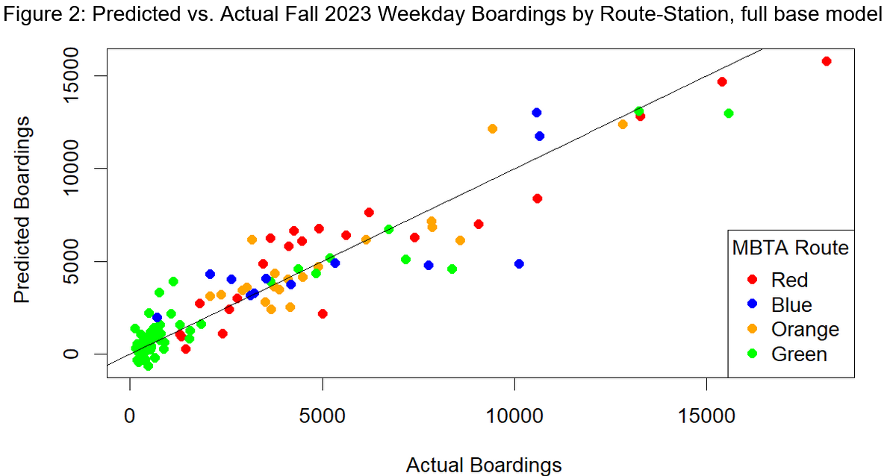
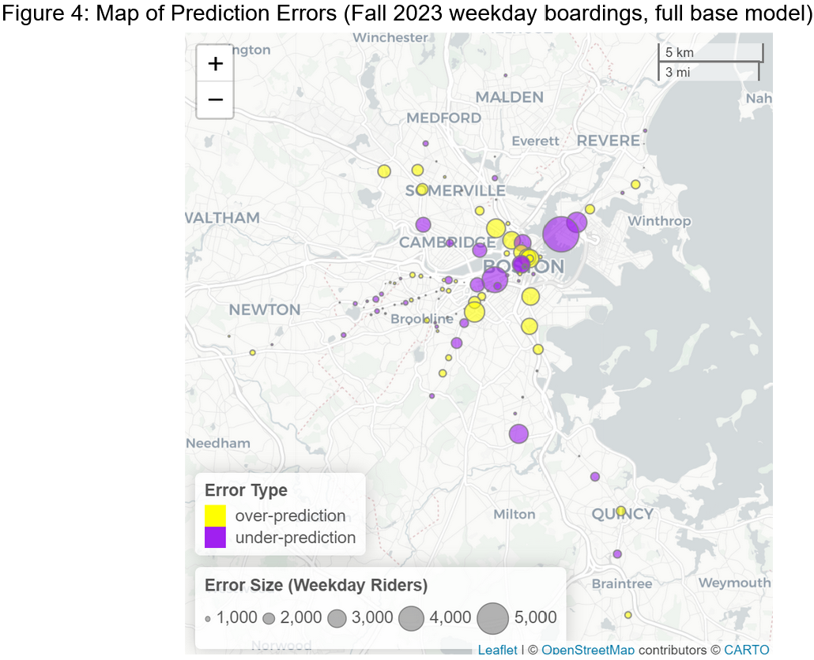

# Using Open Data to Enhance Station-Level Ridership Models

| About the project | :information_source: |
| -----: | :------ |
| Authors: | Emmett Greenberg, Ted Banken, and Ethan McIntosh |
| Course: | Transportation Demand Forecasting (CIVE 7381) |
| Date: | Fall 2024 |

## Summary

Many public transit systems were designed to serve downtown commutes as a primary market, but the rise of remote and hybrid work coming out of the COVID-19 pandemic has scrambled ridership demand patterns. 

This study helps answer the following questions:

* Should transit ridership modelers pivot away from their traditional focus on job density and pay greater attention to colleges, hospitals, shopping centers, and other points of interest that are likely to generate non-work trips?
* What other service characteristics, demographic patterns, and built environment factors have changed since 2019 in terms of how much they affect transit ridership?

Ultimately, we found no evidence that transit ridership models would become significantly more accurate by incorporating the locations of non-work trip generators. However, our models suggest that improving walkability and encouraging mixed land uses around transit stations can yield strong and complementary increases in post-pandemic ridership potential. Our findings also confirm more general policy lessons from previous literature about the importance of service frequency and connectivity for attracting riders to public transit. 

## Data Sources and Methods

Working with my teammates, I built a series of regression models in R to predict average boardings per MBTA subway station. We performed spatial and tabular data processing in R and Python to construct model variables using a variety of open data sources:

| Data Source | Variable(s) |
| :---- | :----- |
| MBTA Open Data Portal | boardings, travel times |
| MBTA General Transit Feed Specification (GTFS) feed | frequencies; stop spacings; transfers to bus, commuter rail, and other subway lines |
| CTPS | MBTA park-n-ride capacity | 
| OpenRoutingService API | 10-minute walkshed areas |
| Walk Score API | Walk Score |
| MassGIS Parcels | Land use entropy |
| US Census | population, jobs, median incomes, vehicle ownership |
| National Center for Education Statistics | college enrollments |
| Inside Airbnb | Airbnb listings |
| City of Boston Open Data Portal | hotels, hospitals |

All of the code for our data processing and model building steps is available on [the project's Github repository](https://github.com/mciethan/mbta-ridership-prediction).

## Results and Analysis

We found that the strongest predictors of MBTA subway ridership were high train frequencies, connections to other routes and modes, and walkable, mixed-land-use station areas. While several other variables were not statistically significant predictors of ridership, almost all variables predicted ridership in the directions we expected. 

Going against our hypothesis, the addition of non-traditional variables of non-home, non-work trip generators such as colleges, hospitals, and hotels did not meaningfully improve model performance for either our models of the full MBTA network or our Boston-only models (which we built because for some variables, we only had data from within the city of Boston). Unfortunately, our models likely suffered from specification issues, and some variables had to be removed from the model due to high multicollinearity (measured using variance inflation factors) among the independent variables. 

That being said, our models achieved a decent overall fit without systematic bias toward particular directions, routes, or neighborhoods, as confirmed through both visualizations like the ones below and through statistical tests described in [our full report](https://docs.google.com/document/d/1bCEKMQc2sCZsuZDSd6N0AVITrZFgVIpXqUhIXhQ5qhY/edit?usp=sharing).

 While our models' absolute errors in predicting station-level ridership are still likely too large for them to be directly useful in transit planning or operations applications, our findings echo previous literature about the ridership impacts of not just transit service characteristics like frequency and connectivity, but also built-environment factors like land use mixing and walkability around transit stations.