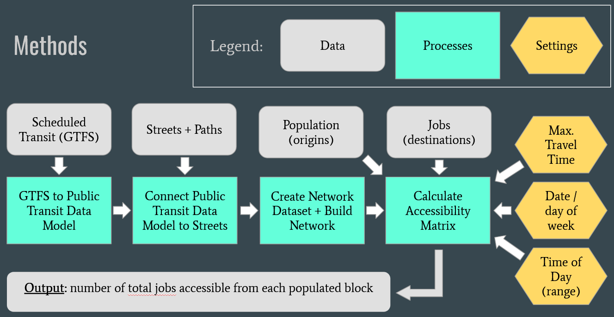
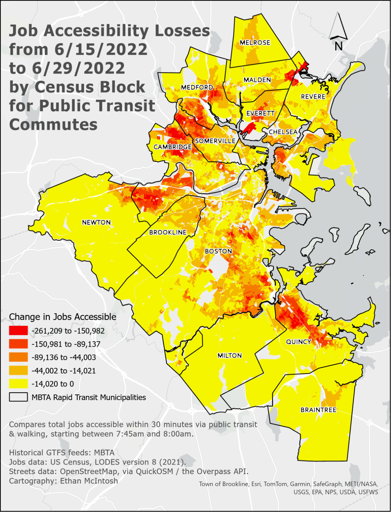
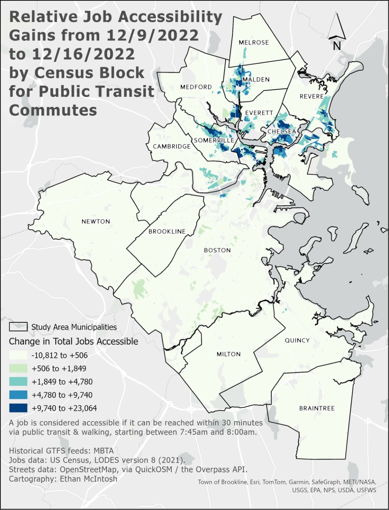

# Measuring the Effects of Public Transit Frequencies on Job Access in Boston

| About the project | :information_source: |
| :---- | :----- |
| Author: | Ethan McIntosh |
| Course: | Advanced Spatial Analysis (PPUA 7237) |
| Date: | Spring 2024 |

## Summary

Destination access metrics are increasingly being used by transportation practitioners to evaluate the benefits of major capital projects like network redesigns and route extensions, but less well-understood are the destination access impacts of changes in how we operate transit service on existing infrastructure.

This study helps answer the following questions:
* How much can job access levels change across neighborhoods and populations in response to changes in the frequencies of transit vehicles at stops?
* How might the destination access impacts of frequency changes compare with those of route extensions?

Using a June 2022 round of MBTA subway service cuts as a case study, I found that changes in job access due to network-wide changes in train frequency can have a highly unequal distribution both spatially and demographically. Additionally, by comparing the net access losses from these frequency cuts with the net access gains resulting from the MBTA’s Green Line Extension, I demonstrate that improving operational frequencies on existing transit infrastructure can yield aggregate gains in destination access which dwarf those provided by major expansions of infrastructure.

## Data Sources and Methods

To measure the number of jobs accessible within 30 minutes of journey time via public transit and walking for residents of the MBTA rapid transit service area, I applied network analysis techniques in ArcGIS Pro to process granular data on population, jobs, transit schedules, and walking routes from the US Census, the MBTA's General Transit Feed Specification (GTFS) feeds, and OpenStreetMap.

I also built an R script to generate descriptive statistics of transit frequencies from GTFS feeds and used Excel and ArcGIS Pro to analyze and visualize the network analysis results.

## Results and Analysis

In June 2022, the MBTA cut service and increased median wait times between trains on each of its subway lines by 2-4 minutes each in order to address safety hazards identified by an FTA investigation. After these service cuts, the average study area resident had access to 8.9% fewer jobs via public transit wihin 30 minutes than they did before the cuts, and a full quarter of residents lost access to more than 18.3% of the jobs they could previously reach. Job access losses were relatively equal across racial/ethnic groups in absolute terms, reflecting the "across-the-board" nature of the cuts, but in relative terms, job access impacts were disproportionately borne by Black residents, who had lower levels of job access via transit prior to the cuts.

*
Table 2: Average Job Access by Race/Ethnicity
*

| Race/Ethnicity | Job Access on 6/15/22 | Loss of Job Access from 6/15/22 to 6/29/22 |	% Loss of Job Access from 6/15/22 to 6/29/22 |
| ---- | ----- | ---- | ---- |
| Asian or Pacific Islander alone* | 332,657 | -29,337 | -8.8% | 
| Hispanic of any race | 316,707 | -27,303 | -8.6% | 
| White alone*	| 301,949 | -25,420 | -8.4% | 
| Other Race alone or Two or More Races* | 285,003 | -27,878 | -9.8% | 
| Black alone*	| 246,753 | -27,067	| -11.0% | 

*
\* non-Hispanic only
*

The highly unequal distribution of job access losses from the June 2022 service cuts is most starkly illustrated in geographic terms. The most outlying and the most central neighborhoods saw low to modest losses, but in some neighborhoods near the termini of the MBTA's Red and Green Lines, the number of jobs residents could reach within 30 minutes via transit and walking fell by 150,000 or more, often representing large majorities of the jobs they could previously access in that time. 

To put these numbers into perspective, no neighborhoods gained access to more than 25,000 additional jobs within 30 minutes via transit and walking directly after the opening of the Medford Branch from the MBTA's Green Line Extension (GLX), a multi-billion dollar project which extended direct light rail service to new neighborhoods.

| June 2022 MBTA subway frequency cuts | December 2022 opening of GLX Medford Branch |
| --- | --- |
|  |  |

These results illustrate that when changes to transit frequencies, even across-the-board ones, are applied to uneven and network-dependent geographies of jobs and people, destination access outcomes can be large and unequal across neighborhoods and populations. For policy makers, this project demonstrates the applicability of destination access analysis for assessing the social and geographic equity impacts of operating frequency changes, not just major routing changes. 