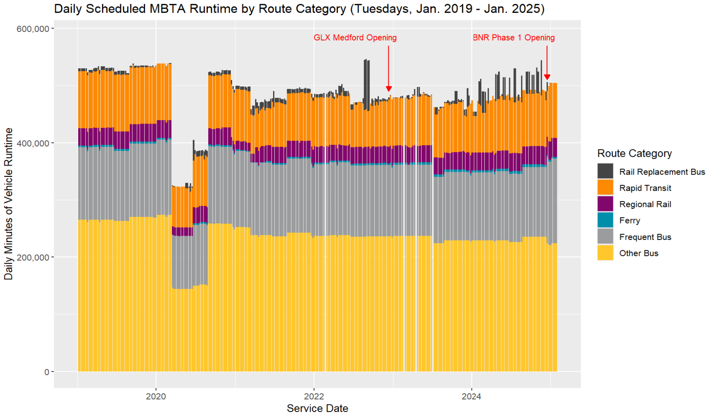
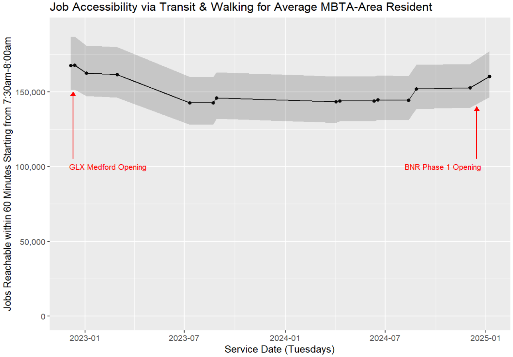
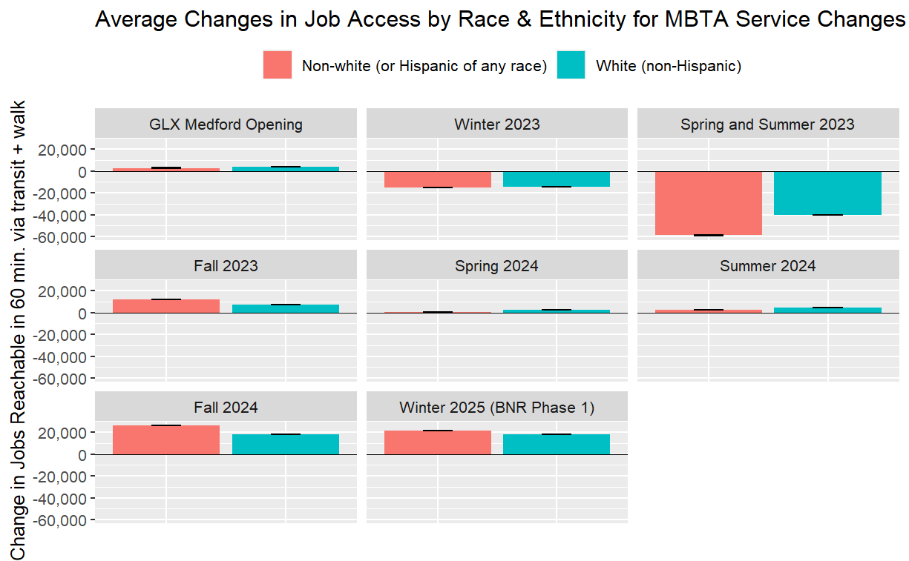

# Measuring the Destination Access Impacts of Public Transit Service Adjustments

| About the project | :information_source: |
| :----- | :------ |
| Author: | Ethan McIntosh |
| Course: | Practicum (PPUA 6966) |
| Date: | Spring 2025 |

## Summary

Public transit agencies make regular adjustments to scheduled vehicle frequencies and trip times in response to changing operating conditions. However, most analyses of social equity and destination accessibility in public transit service are limited to understanding the potential impacts of larger-scale service changes, such as route extensions or network redesigns. 

For example, current Title VI policies only require US-based transit agencies to examine possible disparate impacts on protected populations for a subset of service changes that are considered "major", as defined by percentage change thresholds in quantity-of-service measures like revenue vehicle hours or trip frequencies on a given route or mode. Smaller, more regular changes in transit service typically do not meet agency-defined Title VI thresholds, and their impacts on destination access outcomes for protected populations have attracted limited attention in the research literature.

This study helps answer the following question:
* To what degree do regular (often quarterly) adjustments in public transit schedules affect destination access across populations and geographies?
* How do the destination access impacts of "minor" schedule adjustments compare with the effects of "major" service changes for which equity analyses are mandated under current policies? 

Analyzing eight MBTA service changes between 2022 and 2025, I found that quarterly service adjustments can have significant and disparate impacts on the numbers of valued destinations that different demographic groups can access within a given travel time budget. In other words, many "minor" service changes, as defined by changes in trip frequencies or total runtime, aren't as minor as they seem. My findings suggest that measures of destination access provide a useful high-level framework for transit agencies to improve on existing Title VI policies by continuously assessing how both large- and small-scale changes in service either reinforce or counteract existing inequities.

## Data Sources and Methods

The eight MBTA service changes I studied consisted of 6 smaller-scale quarterly service changes that occurred between 2 larger MBTA projects: the opening of the Green Line Extension (GLX) Medford Branch in December 2022 and the implementation of Phase 1 of the Bus Network Redesign (BNR) in December 2025. To capture the more permanent effects of each service change while minimizing the confounding effects of temporary service diversions, I chose before and after dates for each change that either had minimal or roughly equivalent Rail Replacement Bus service (temporary shuttling) before and after each change.

To determine which dates had temporary shuttling and to help place my main analysis of destination access changes into context, I first calculated the start and end of service, number of trips, and total transit vehicle runtimes and distances for each day going back multiple years, using General Transit Feed Specification (GTFS) feeds as my data source. These kinds of quantity-of-service measures are what transit agencies typically use to identify whether a service change is "major" or not for a particular route or mode. Total MBTA runtime on non-temporary services, a proxy for the overall quantity of service, was flat or declining in late 2022 and 2023, before starting to steadily climb in 2024 as the agency made progress on its Track Improvement Program and grew its bus operator headcount.

To measure the number of jobs accessible within 60 minutes of journey time via public transit and walking on a given service date, I processed block-level population and jobs data from the US Census, archived transit schedules in the GTFS format, and walking routes from OpenStreetMap in order to perform origin-destination network analyses using the R5 routing engine. I completed all data processing and analysis steps in R, and all of my code is  available on [the project's Github repository](https://github.com/mciethan/transit-destination-access).

## Results and Analysis

The number of jobs reachable via transit for the average MBTA resident declined in the first half of 2023 and remaining effectively flat from July 2023 to July 2024 before starting to recover in fall 2024, generally aligning with the trend in total transit vehicle runtime. On the chart below, the line represents the jobs reachable within 60 minutes of transit & walking time for typical departure times between 7:30am and 8:00am on a Tuesday. The gray area around the line represents the variability in job access associated with the exact choice of departure time within that half-hour window, since one's exact timing can result in more or less waiting time for transit vehicles.

My full report reveals that many kinds of variation exist within these average levels of job access, with service changes to the frequencies and speeds of different kinds of transit routes having different effects on the distributions of destination access across neighborhoods and populations. One important policy takeaway is that for non-white residents in the MBTA service area, job access tends to change more sharply in response to service changes than for white residents, with some changes resulting in relatively large racial disparities in job access impacts. I conducted ANOVA analyses with Tukey post-hoc tests which confirmed the statistical significance of these racial disparities, but the standard error whiskers in the chart below give a visual sense for the precision of the average changes in job access for white and non-white residents per service change. 

My case study of MBTA service changes shows that when "minor" changes in trips and revenue vehicle hours are applied to many routes, they can add up to yield larger changes in destination access outcomes than "major" changes on a small number of routes, both on average and on aggregate. This highlights a gap in current Title VI policies for transit agencies as defined by the FTA, which only require transit agencies to analyze the potential disparate impacts of a subset of "major" changes. Transit policies should instead encourage continuous evaluation of service outcomes for large and small changes alike.

Additionally, I argue that transit agencies should abandon the use of narrow quantity-of-service thresholds for determining which service changes merit analysis of disparate impacts and identifying when disparate impacts require additional justification or mitigation. Destination access measures improve on quantity-of-service measures for this purpose by better capturing how the rider benefits of a given transit service scenario are sensitive to (i) differences in transit service typologies, (ii) differences in how transit services connect to population and activity centers, and (iii) network effects going beyond the individual route level due to transfer timings.

Ultimately, the use of better threshold measures in Title VI service change policies can help transit agencies better serve these policies' original purposes: ensuring that transit service changes promote social equity and avoid disproportionate harm to protected populations.